Creating Agentforce Custom Actions with Heroku
==============================================

This tutorial will guide you through configuring an Agentforce Action deployed to Heroku within your Salesforce org. This allows Agentforce agents to access powerful custom-coded actions written in Python and other languages, leveraging Heroku's fully managed and elastic compute service. By the end, you will be able to generate your own badge as shown below!

> 💡 **Heroku Integration Pilot Notice:** These steps utilize generally availble features in Heroku and Salesforce. If you have joined the Heroku Integration pilot program and want to explore creating Agentforce Actions please ask for further information or check back here in the future for alternative steps.

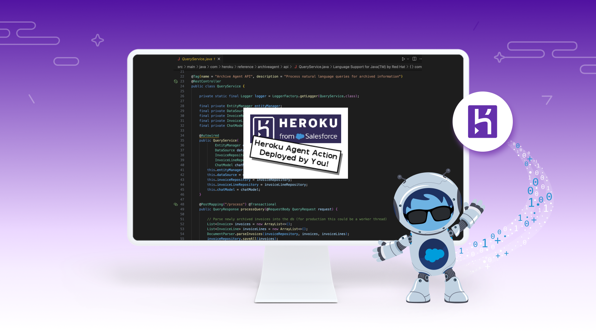

Want to learn more before diving in?
------------------------------------

The examples in this tutorial are intentionally simple, designed to give you a clear starting point for creating your own actions. We have also included fully developed actions, and we recommend watching the video demonstrations first. Once you’re ready, proceed below to start building your own Agentforce Action with Heroku.

| Example | Demo Video |  | Related Content
| ------- | ---------- | ---------- | ---------------
| The **Archive Agent** action demonstrates using Heroku to access and perform complex computations over unstructured archived data. It uses AI to interpret natural language requests from users to perform a wider array of dynamic calculations on the data. | [Link](https://youtu.be/mNgrdf1GX-w) | 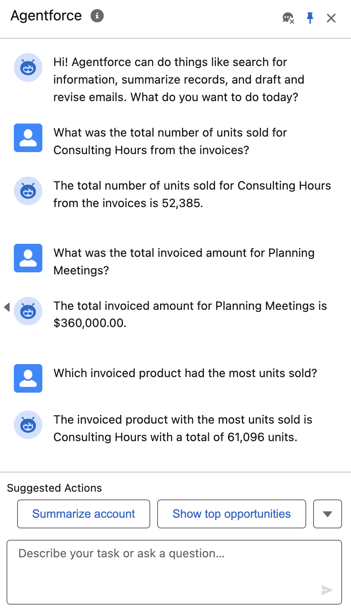 | [Blog](https://blog.heroku.com/building-supercharged-agents-heroku-agentforce) [Code](https://github.com/heroku-examples/agentforce-collage-agent)
| With the **Coral Cloud Collage Agent**, we explore how Coral Cloud Resort invites its guests to browse and book unique experiences throughout their stay using Agentforce. With Heroku, we extend the agent's functionality to generate a personalized collage of each guest's adventures, showcasing how custom code deployed on Heroku can create dynamic digital media delivered directly within the Agentforce experience. | [Link](https://www.youtube.com/watch?v=yd97A9GLFUA&t=3s) | 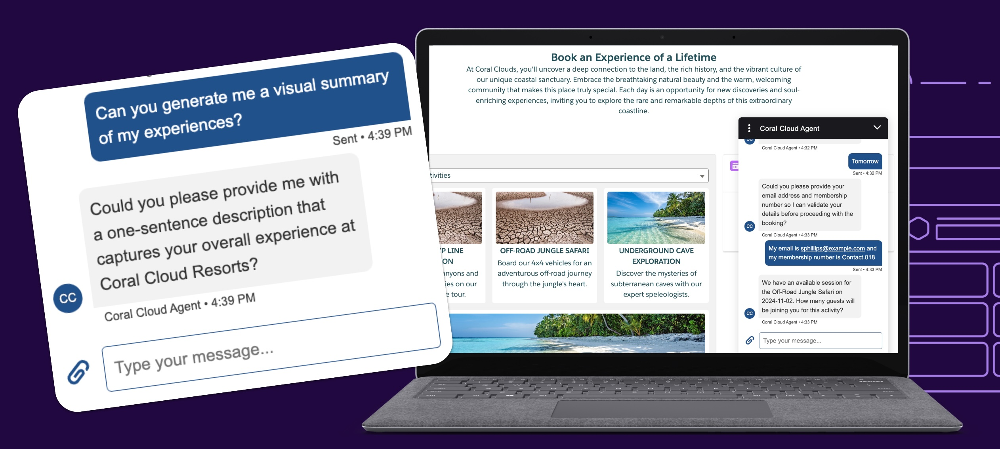  | [Code](https://github.com/heroku-examples/agentforce-collage-agent)

Step 1 - Action API URL
-----------------------

> 💡 **Salesforce Org Requirements:** Ensure you have access to Agentforce in your org by searching for `Agents` in the `Setup` menu. If not, you can create a temporary org by logging into Trailhead and creating a Playground per the instructions [at the top of this module](https://trailhead.salesforce.com/content/learn/projects/quick-start-explore-the-coral-cloud-sample-app/deploy-the-coral-cloud-sample-app) (you do not need to complete the module). Once you have access to the org, locate `Einstein Setup` under the `Setup` menu and enable Einstein, which will also enable Agentforce.

This tutorial provides examples in Java and Python for coding a basic Agentforce action. You can deploy these to your own Heroku account or proceed for now with the pre-deployed versions we have created for you.

| Language | Pre-deployed API URL | Pre-deployed API Test Page | Or Deploy your Own to Heroku
| -------- | --------------- | ------------------- | -----------
| Python | [Action API URL](https://agentforce-tutorial-python-7894e9215571.herokuapp.com/) | [Action API Test Page](https://agentforce-tutorial-python-7894e9215571.herokuapp.com/) | Go to this [GitHub Repository](https://github.com/heroku-examples/heroku-agentforce-tutorial-python)
| Java | [Action API URL](https://agentforce-tutorial-java-fd05948b2c0a.herokuapp.com) | [Action API Test Page](https://agentforce-tutorial-java-fd05948b2c0a.herokuapp.com/swagger-ui/index.html) | Go to this [GitHub Repository](https://github.com/heroku-examples/heroku-agentforce-tutorial-java)

With the above information, you have two paths to take:
- **If you are using the pre-deployed versions**, right-click the ***Action API URL*** link from above and copy the URL to your clipboard when requested below. Optionally, click the ***Action API Test URL*** to try the API out from your browser; this will be the Action API Agentforce will eventually call out to when invoking your action.
- **If you want to deploy your own action before proceeding**, follow the instructions in the respective repository above and return here with the deployed URL.

Step 2 - Creating a Named Credential
------------------------------------

If you have not yet gained access to an Agentforce-enabled environment, please refer to the note above. The following steps assume that you are logged in and have administrator access to the Salesforce `Setup` menu.

1. Search for `Named Credentials` under `Setup`, select the `External Credentials` tab, and click `New`, completing the dialog as shown.

    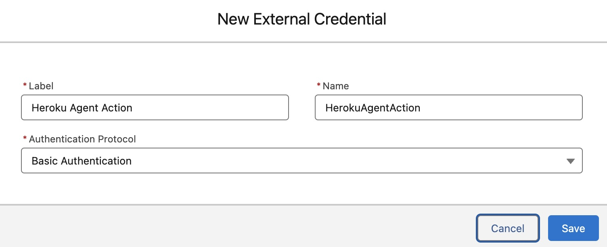

2. Scroll down the next page to the `Principals` section and click `New`, completing the dialog as shown.

    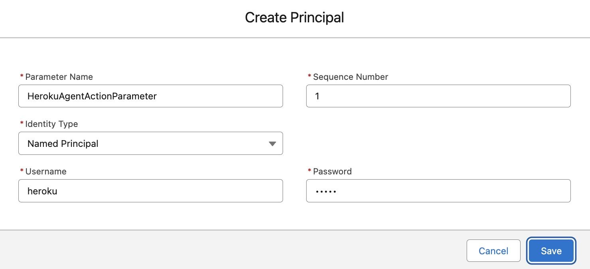

    > The default password for this tutorial is `agent`.

3. Search for `Named Credentials` under `Setup`, select the `Named Credentials` tab, and click `New`, completing the dialog as shown.

    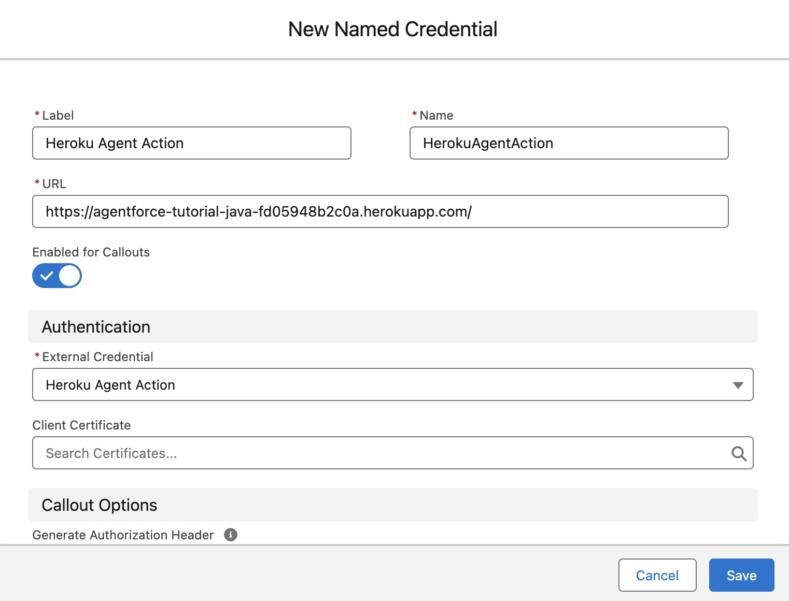

    > To obtain the URL value, right-click the desired `Pre-deployed API URL` above or use the one given to you after completing your own Heroku deployment. The one shown in the screenshot above is the Java pre-deployment.

Step 3 - Registering the Action API
-----------------------------------

1. Search for `External Services` under `Setup` and click `Add an External Service`. Then, select `From API Specification` and click `Next`, completing the dialog as shown, and click `Save & Next`.

    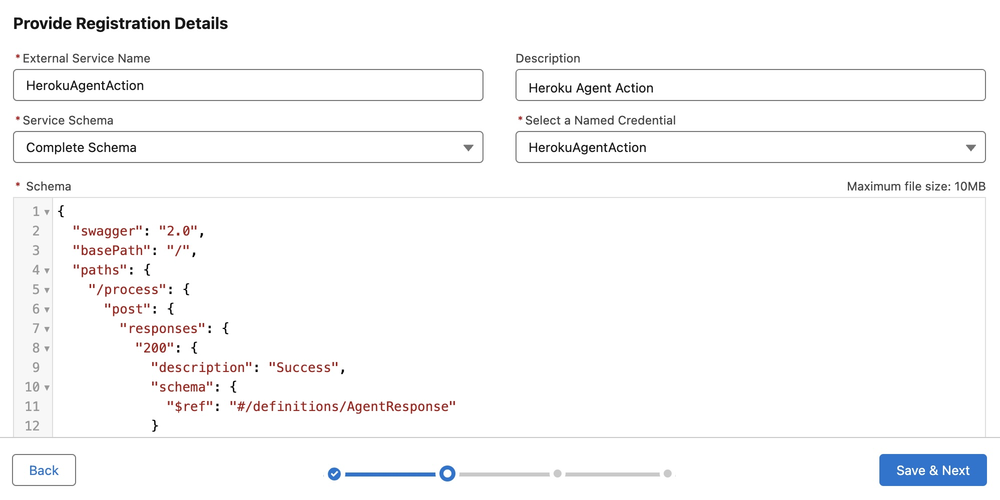

    If you have not modified the action code yet or are using the pre-deployments above, you can click [here](https://agentforce-tutorial-java-fd05948b2c0a.herokuapp.com/v3/api-docs) (Java) or [here](https://agentforce-tutorial-python-7894e9215571.herokuapp.com/swagger.json) (Python) to obtain the schema and copy-paste it into the `Schema` field. Log in when prompted with user `heroku` and password `agent`.
    
    Alternatively, to obtain the dynamically generated schema for your own action deployment, refer to the instructions in the respective GitHub repository in the table above to open the API Test (Swagger) page. Then click the link just below the API title in the top left corner of the page, as shown in the examples below. Then copy and paste the entire contents into the `Schema` field above.
    
    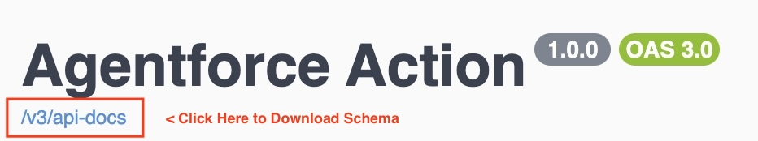  
    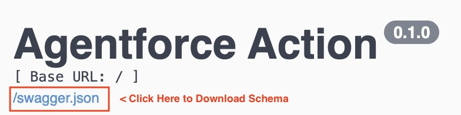
    
    For more information on the API Test (Swagger) page and authentication, see the respective sample code GitHub repositories listed in the table in step 1.

2. Finally, on the next page, select the `Operation` shown below and click `Next`.

    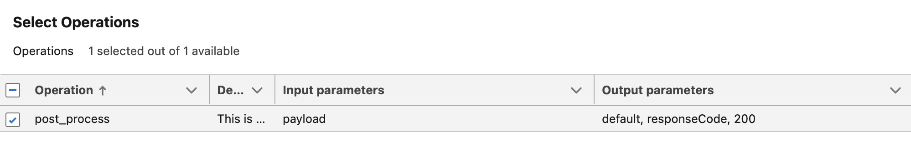

3. Confirm you can see the input and output parameters as shown below, and click `Finish`.

    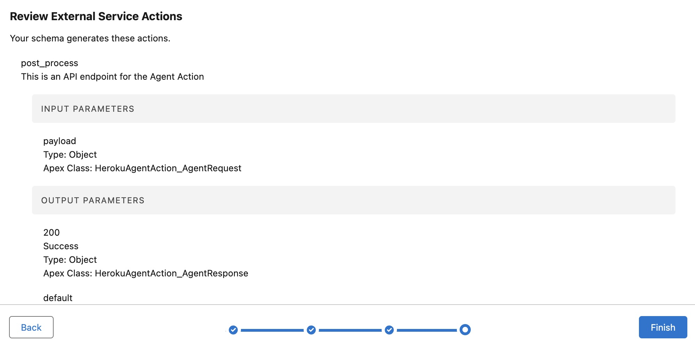

Step 4 - Assigning Permissions
------------------------------

1. Search for `Permission Sets` under `Setup`, click `New`, complete the page as shown, and click `Save`.

    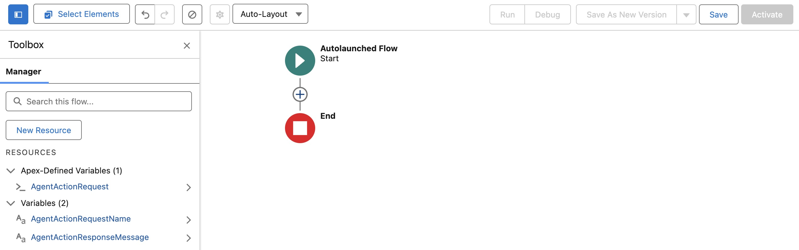

2. Locate the `External Credential Principal Access` section and edit it so that it appears as shown.

    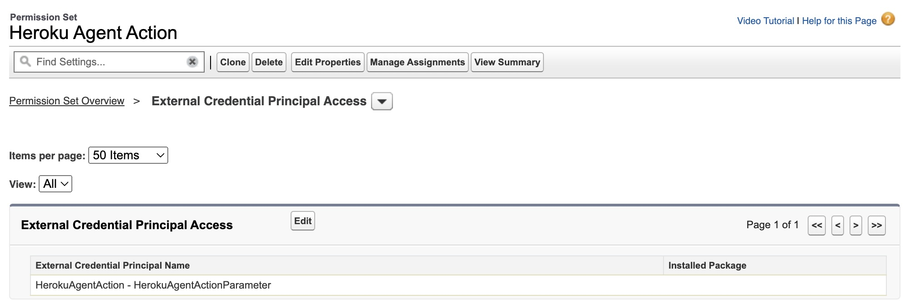

3. Finally, assign the permission set to your current user using the `Manage Assignments` button.

Step 5 - Creating an Agentforce Action
--------------------------------------

1. Search for `Flows` under `Setup` and click `New Flow`. Click `Start from Scratch`, then `Next`, and select `Autolaunched Flow (No Trigger)`. Click `Create` to open the `Flow Builder`.

2. From the `Flow Builder`, open the `Toolbox` by clicking the sidebar icon near the top left of the screen. Click `New Resource` and create the following variable resources.

    - **Resource Type**: Variable
      - **API Name**: AgentActionRequestName
      - **Data Type**: Text
      - **Apex Class**: Not Applicable
      - **Availability Outside the Flow**: Available for Input
    
    - **Resource Type**: Variable
      - **API Name**: AgentActionResponseMessage
      - **Data Type**: Text
      - **Apex Class**: Not Applicable
      - **Availability Outside the Flow**: Available for Output
    
    - **Resource Type**: Variable
      - **API Name**: AgentActionRequest
      - **Data Type**: Apex Defined
      - **Apex Class**: ExternalService__HerokuAgentAction_AgentRequest
      - **Availability Outside the Flow**: None

    Your `Flow` should look like this so far:

    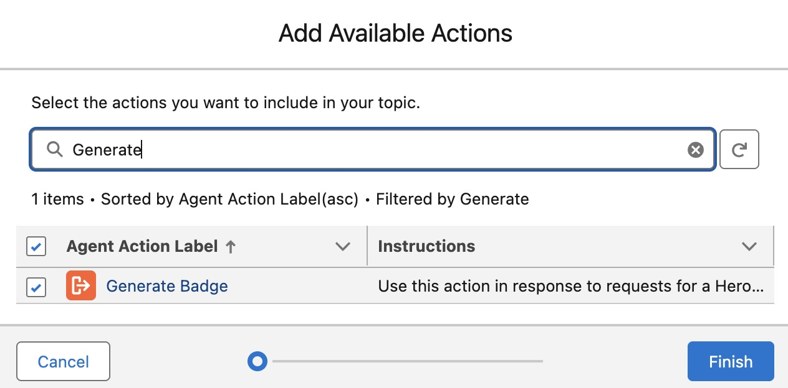

3. Click the `+` icon in the middle of the canvas and select `Action`. In the `Search Actions` sidebar, search for `Heroku`, select the `Post Process` action, and complete the fields as shown.

    

4. Click the `+` icon **before** the `Call Heroku` element on the canvas, select `Assignment`, and complete as shown.

    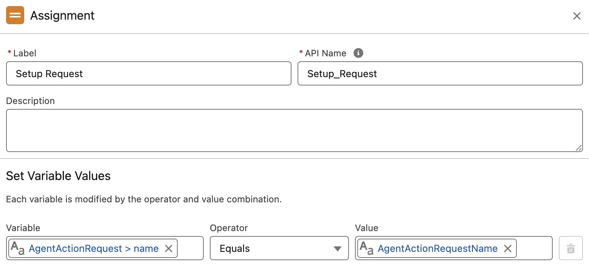

5. Click the `+` icon **after** the `Call Heroku` element on the canvas, select `Assignment`, and complete as shown.

    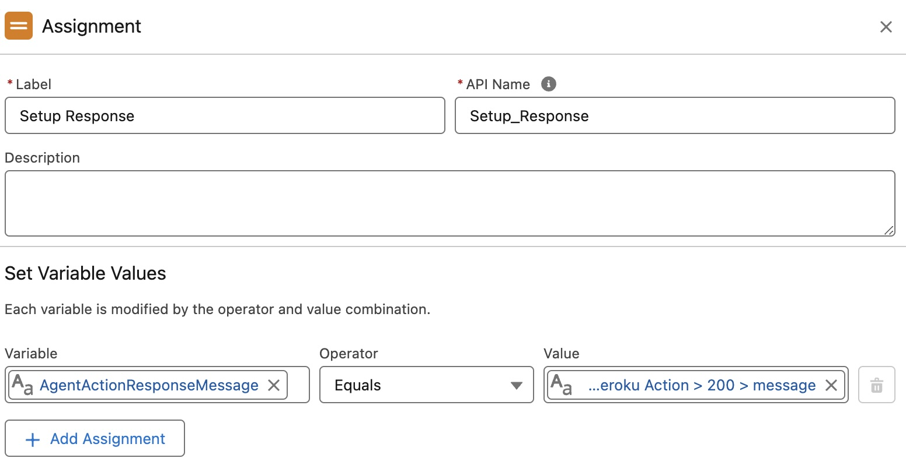

    > **Tip:** To complete the `Value` field click into the field and use the popup to select the `Outputs from the Call Heroku Action` resource, then click `_200` and finally `message`.  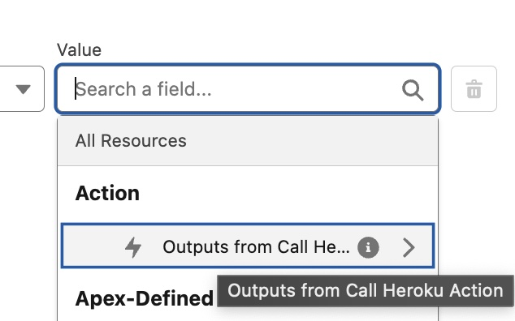

6. Finally, your `Flow` should look like this:

    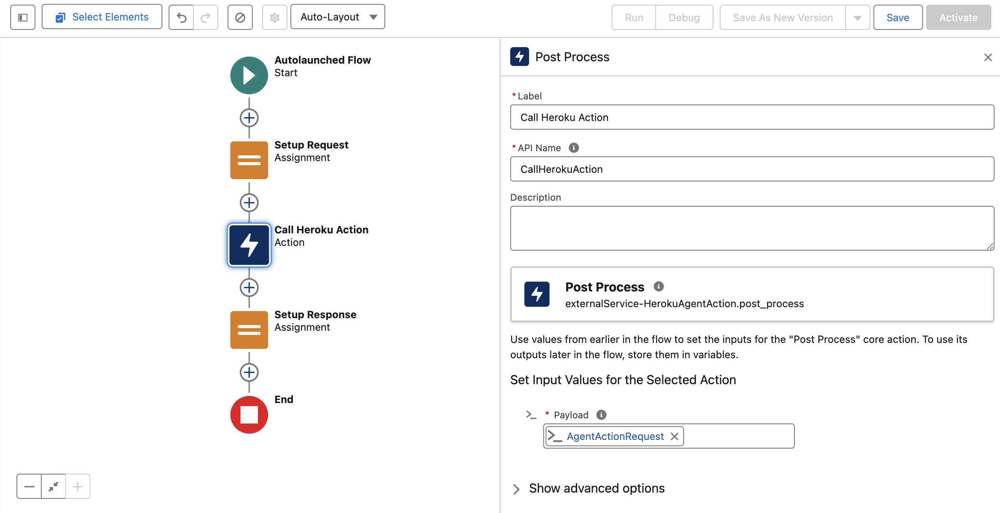

7. Click `Save`, enter `Heroku Agent Action`, and click `Save`, followed by clicking `Activate`.

8. Search for `Agent Actions` under the `Setup` menu, and click `New Agent Action`, selecting `Flow` as the `Reference Action Type`. In the `Reference Action` search field, search for `Heroku` so that you see the following:

    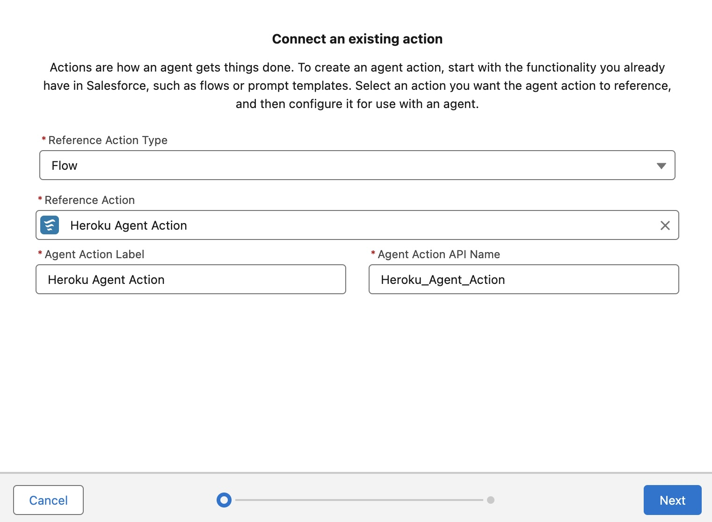

9. Complete defining the action as follows and click `Finish`.

    

    | Field | Text |
    | ----- | ---- |
    | `Agent Action Instructions` | Use this action to produce a unique Heroku badge with a custom name printed on it |
    | `AgentActionRequestName Instructions` | Name to be placed on the badge. Do not show the parameter name. |
    | `AgentActionResponseMessage Instructions` | Render the response as HTML rich text output. |

Step 6 - Using Agent Builder
----------------------------

1. Search for `Agents` under `Setup` and be sure to toggle to enable `Einstein Copilot for Salesforce`.

2. Click the `Einstein Copilot` link at the bottom of the page to find the `Open in Agent Builder` button.

3. Click the `Deactivate` button in the top right of the screen if present.

4. Click `Topics` and the `General CRM` topic. If the `New Version` button is shown, click it.

5. Click the `This Topic's Actions` tab and select `Add from Asset Library` from the `New` button dropdown.

6. Complete the dialog as shown and click `Finish`.

    

7. Finally, click the `Activate` button in the top right of the screen.

Step 7 - Testing your Action
----------------------------

1. Open the `Agent Builder` for `Einstein Copilot`.

2. In the `Conversation Preview`, enter `Generate my badge with the name Master Builder on it!`

    > You can, of course, change the name to your own and share your badge with your friends!

    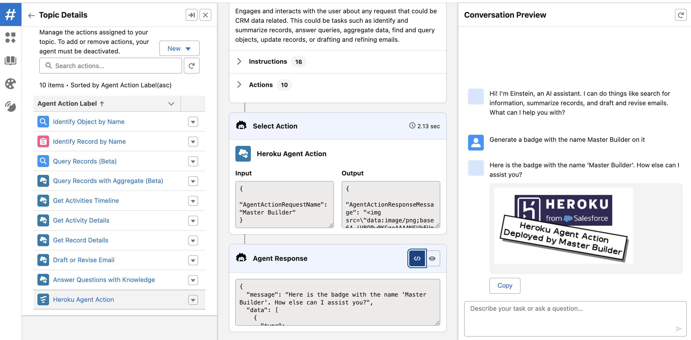

Summary
-------

Congratulations on deploying your first Heroku-powered Agentforce Action!

We are working to improve and simplify this process, so please follow this repository to stay informed on updates.
