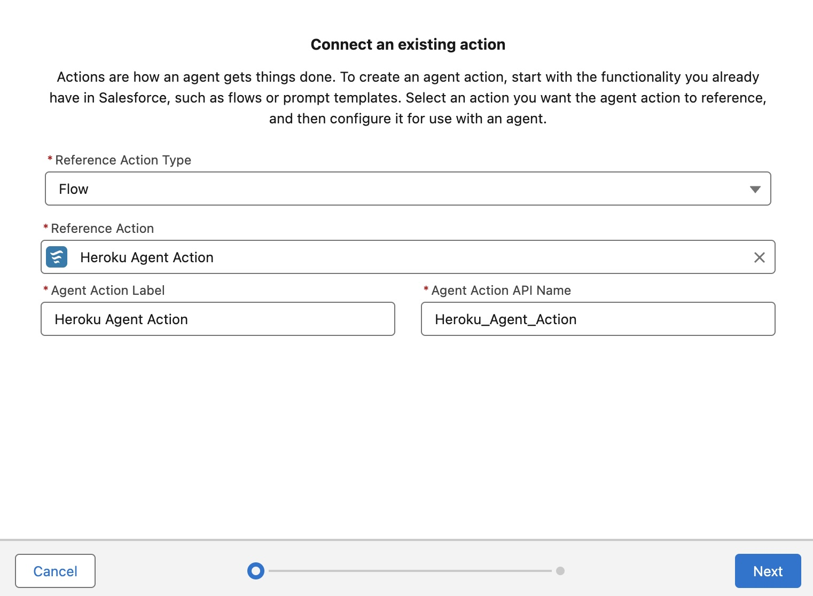
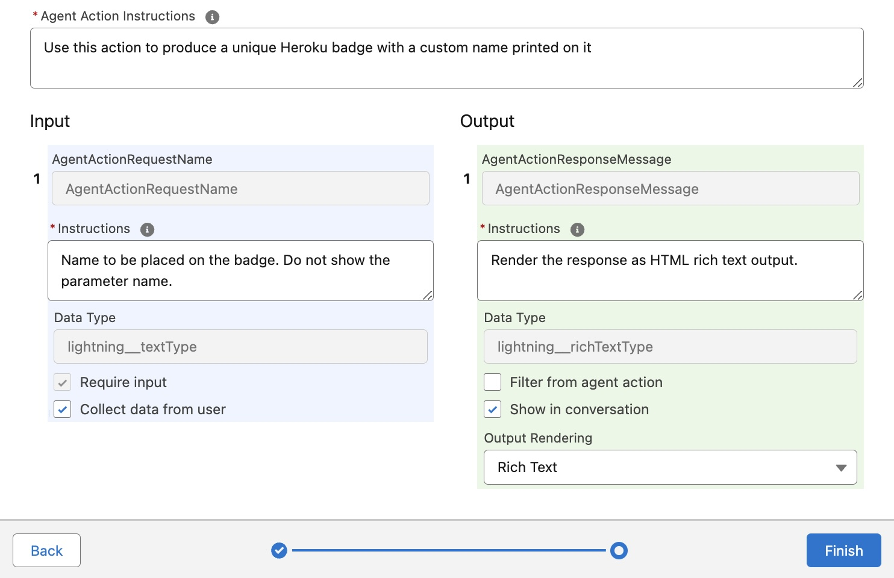
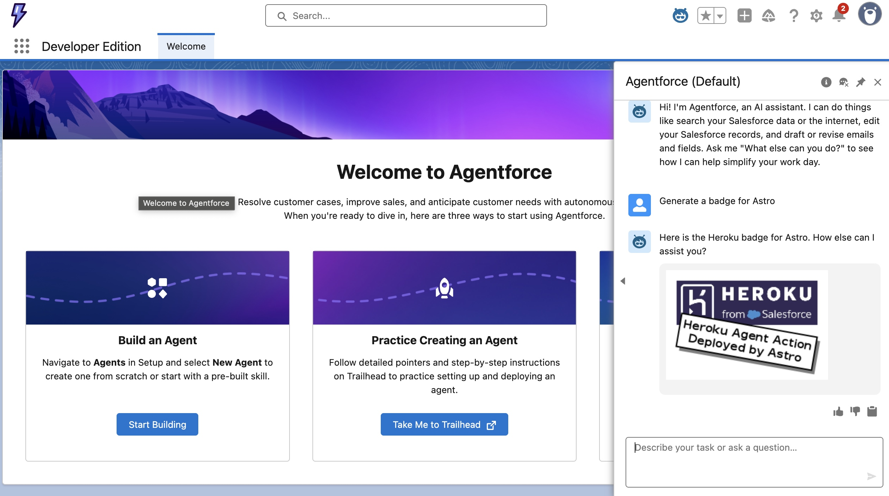

Creating Agentforce Custom Actions with Heroku
==============================================

This tutorial will guide you through configuring an Agentforce Action deployed to Heroku within your Salesforce org. This allows Agentforce agents to access powerful custom-coded actions written in Python and other languages, leveraging Heroku's fully managed and elastic compute service. By the end, you will be able to generate your own badge as shown below!


Step 1 - Deploy to Heroku
-------------------------

This tutorial provides examples in Java and Python for coding a basic Agentforce action. Complete the standard Heroku deployment instructions in one of the following repositories before progressing to the next step.

| Language | GitHub Repository
| -------- | ---------------
| Python | [GitHub Repository](https://github.com/heroku-examples/heroku-agentforce-tutorial-python)
| Java | [GitHub Repository](https://github.com/heroku-examples/heroku-agentforce-tutorial-java)

Step 2 - Publishing your Heroku App into a Salesforce org
---------------------------------------------------------

> 💡 **Heroku AppLink:**<br/> These steps utilize generally availble features in Heroku and Salesforce. If you had joined the Heroku Integration pilot program please refer to these alternative [instructions](https://github.com/heroku-examples/heroku-agentforce-tutorial/tree/heroku-integration-pilot).


> 💡 **Salesforce Org Requirements:**<br/>Ensure you have access to Agentforce in your org by searching for `Agents` in the `Setup` menu. If not, you can obtain a free [Salesforce Developer Edition org here](https://www.salesforce.com/form/developer-signup/?d=pb). Be sure to visit `Einstein Setup` to enable Einstein, the fresh the page and search for `Agentforce Agents` to enable Agentforce. Finally on the same page click `Enable the Agentforce (Default) Agent`.

From the directory you completed the above deployment in, run the following commands.
=======
> 💡 **Salesforce Org Requirements:** Ensure you have access to Agentforce in your org by searching for `Agents` in the `Setup` menu. If not, you can create a temporary org by logging into Trailhead and creating a Playground per the instructions [at the top of this module](https://trailhead.salesforce.com/content/learn/projects/quick-start-explore-the-coral-cloud-sample-app/deploy-the-coral-cloud-sample-app) (you do not need to complete the module). Once you have access to the org, locate `Einstein Setup` under the `Setup` menu and **Enable Einstein**, which will also enable Agentforce.

Add Heroku AppLink to your application.

```
heroku addons:create heroku-applink
```

Configure the application ID as follows:

```
heroku config:set HEROKU_APP_ID="$(heroku apps:info --json | jq -r '.app.id')"
```

> 💡 **jq utility:**<br/>If you do not have the `jq` utlity, run `heroku apps:info --json` manually and extract the value from the `app` json structure output to the console.

Connect your Heroku application to the org you intend to configure Agentforce within.

```
heroku salesforce:connect my-org
```

Add Heroku AppLink Service Mesh buildpack to ensure incoming calls from the Salesforce org are authenticated correctly.

```
$ heroku buildpacks:add https://github.com/heroku/heroku-buildpack-heroku-applink-service-mesh
```

Import your applications and its API specification into the connected org, for Python use `api-spec.json`.

```
heroku salesforce:publish api-spec.yaml --client-name BadgeService --connection-name my-org --authorization-connected-app-name BadgeServiceConnectedApp --authorization-permission-set-name BadgeServicePermissions
```

Lastly trigger a redeploy of the application to ensure the service mesh is running using the following commands.

```
git commit --allow-empty -m "empty commit"
git push heroku main
```

Once complete check your application has been imported by searching for **Heroku** and then **Apps** under the **Setup** menu in your org.

Step 3 - Assigning Permissions
------------------------------

The above process created `BadgeService` and `BadgeServicePermissions` permission sets to control access to your application from within the org. Search for **Permisison Sets** under **Setup**, locate these permission sets and click **Manage Assignments** to assign to your user.

Step 4 - Creating an Agentforce Action
--------------------------------------

1. Search for `Agent Assets` under the `Setup` menu, and on the `Actions` tab, click `New Agent Action`, selecting `API` as the `Reference Action Type`. Then select `Heroku` from the `Reference Action Category`. In the `Reference Action` search field, search for `Generate Badge`. Your dialog should look like the following:

    

9. Complete defining the action as follows and click `Finish`.

    

Step 5 - Using Agent Builder
=======
    | Field | Text |
    | ----- | ---- |
    | `Agent Action Instructions` | Use this action in response to requests for a Heroku badge with a name on it. |
    | `AgentActionRequestName Instructions` | Name to be placed on the badge. |
    | `AgentActionResponseMessage Instructions` | This is the Heroku badge the user requested. |

----------------------------

1. Search for `Agentforce Agents` under `Setup`.

2. Click the `Agentforce (Default)` link at the bottom of the page to find the `Open in Agent Builder` button.

3. Click the `Deactivate` button in the top right of the screen if present.

4. Click `Topics` and the `General CRM` topic. If the `New Version` button is shown, click it.

5. Click the `Topic Configuration` tab and append "***Also including requests for badges.***" to the current contents of the `Classification Description` field. Click `Save`.

6. Click the `This Topic's Actions` tab and select `Add from Asset Library` from the `New` button dropdown.

7. Complete the dialog as shown and click `Finish`.

    

8. Finally, click the `Activate` button in the top right of the screen.

Step 6 - Testing your Action
----------------------------

1. Open the `Agent Builder` for `Einstein Copilot`.

2. In the `Conversation Preview`, enter `Generate a badge for Astro`

    > You can, of course, change the name to your own and share your badge with your friends!

    

Summary
-------


**Congratulations on deploying your first Heroku-powered Agentforce Action!**

We are working to improve and simplify this process, so please follow this repository to stay informed on updates.

Need some inspiration on what to build?
---------------------------------------

The examples in this tutorial are intentionally simple, designed to give you a clear starting point for creating your own actions. We have also included fully developed actions below.

| Example | Demo Video |  | Related Content
| ------- | ---------- | ---------- | ---------------
| The **Archive Agent** action demonstrates using Heroku to access and perform complex computations over unstructured archived data. It uses AI to interpret natural language requests from users to perform a wider array of dynamic calculations on the data. | [Link](https://youtu.be/mNgrdf1GX-w) |  | [Blog](https://blog.heroku.com/building-supercharged-agents-heroku-agentforce) [Code]([https://github.com/heroku-examples/agentforce-collage-agent](https://github.com/heroku-reference-apps/agentforce-archive-agent))
| With the **Coral Cloud Collage Agent**, we explore how Coral Cloud Resort invites its guests to browse and book unique experiences throughout their stay using Agentforce. With Heroku, we extend the agent's functionality to generate a personalized collage of each guest's adventures, showcasing how custom code deployed on Heroku can create dynamic digital media delivered directly within the Agentforce experience. | [Link](https://www.youtube.com/watch?v=yd97A9GLFUA&t=3s) |   | [Code](https://github.com/heroku-examples/agentforce-collage-agent)
