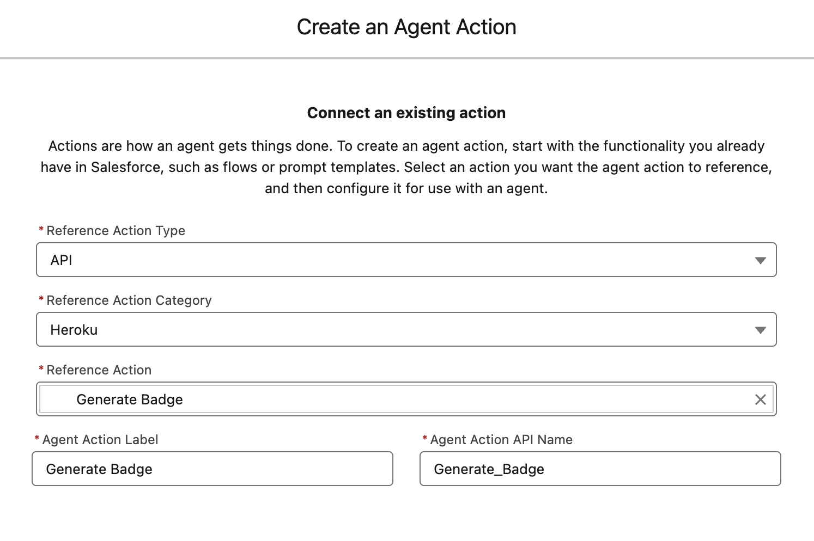

Creating Agentforce Custom Actions with Heroku
==============================================

> 💡 **Heroku Integration Pilot Only:**<br/>This branch is only intended for developers who have joined the Heroku Integration Pilot. If you have are not part of the pilot please refer to the main branch of this repository for alternative instructions.

This tutorial will guide you through configuring an Agentforce Action deployed to Heroku within your Salesforce org. This allows Agentforce agents to access powerful custom-coded actions written in Python and other languages, leveraging Heroku's fully managed and elastic compute service. By the end, you will be able to generate your own badge as shown below!


Step 1 - Deploy to Heroku
-------------------------

This tutorial provides examples in Java and Python for coding a basic Agentforce action. 

Complete the standard Heroku deployment instructions in one of the following repositories before progressing to the next step.

| Language | GitHub Repository
| -------- | ---------------
| Python | [GitHub Repository](https://github.com/heroku-examples/heroku-agentforce-tutorial-python/tree/heroku-integration-pilot)
| Java | [GitHub Repository](https://github.com/heroku-examples/heroku-agentforce-tutorial-java/tree/heroku-integration-pilot)

Step 2 - Importing your Heorku App into a Salesforce org
--------------------------------------------------------

> 💡 **Salesforce Org Requirements:**<br/>Ensure you have access to Agentforce in your org by searching for `Agents` in the `Setup` menu. If not, you can create a temporary org by logging into Trailhead and creating a Playground per the instructions [at the top of this module](https://trailhead.salesforce.com/content/learn/projects/quick-start-explore-the-coral-cloud-sample-app/deploy-the-coral-cloud-sample-app) (you do not need to complete the module). Once you have access to the org, locate `Einstein Setup` under the `Setup` menu and enable Einstein, which will also enable Agentforce.

From the directory you completed the above deployment in, run the following commands.

Add the Heroku Integration add-on to your application.
```
$ heroku addons:create heroku-integration
```
Connect your Heroku application to the org you intend to configure Agentforce within.
```
$ heroku salesforce:connect my-org --login-url "https://login.salesforce.com" --store-as-run-as-user
```
Install the Heroku Integration Service Mesh buildpack to ensure incoming calls from the Salesforce org are authenticated correctly.
```
$ heroku buildpacks:add https://github.com/heroku/heroku-buildpack-heroku-integration-service-mesh
$ git commit --allow-empty -m "empty commit"
$ git push heroku heroku-integration-pilot:main
```
Import your application as an action into the connected org.
```
$ heroku salesforce:import api-spec.yaml --org-name my-org --client-name HerokuAgentAction
```

Once complete check your application has been imported by searching for **Heroku** and then **Apps** under the **Setup** menu in your org.

Step 3 - Assigning Permissions
------------------------------

The above process created a `HerokuAgentAction` permission set to control access to your application from within the org. Search for **Permisison Sets** under **Setup**, locate this permission set and click **Manage Assignments** to assign to your user.

Step 4 - Creating an Agentforce Action
--------------------------------------

At present to make your imported app accessable to Agentforce you must create a Flow wrapper. This requirement will be removed in the future.

1. Search for `Flows` under `Setup` and click `New Flow`. Click `Start from Scratch`, then `Next`, and select `Autolaunched Flow (No Trigger)`. Click `Create` to open the `Flow Builder`.

2. From the `Flow Builder`, open the `Toolbox` by clicking the sidebar icon near the top left of the screen. Click `New Resource` and create the following variable resources.

    - **Resource Type**: Variable
      - **API Name**: AgentActionRequestName
      - **Data Type**: Text
      - **Apex Class**: Not Applicable
      - **Availability Outside the Flow**: Available for Input
    
    - **Resource Type**: Variable
      - **API Name**: AgentActionResponseMessage
      - **Data Type**: Text
      - **Apex Class**: Not Applicable
      - **Availability Outside the Flow**: Available for Output
    
    - **Resource Type**: Variable
      - **API Name**: AgentActionRequest
      - **Data Type**: Apex Defined
      - **Apex Class**: ExternalService__HerokuAgentAction_AgentRequest
      - **Availability Outside the Flow**: None

    Your `Flow` should look like this so far:

    

3. Click the `+` icon in the middle of the canvas and select `Action`. In the `Search Actions` sidebar, search for `Heroku`, select the `Post Process` action, and complete the fields as shown.

    

4. Click the `+` icon **before** the `Call Heroku` element on the canvas, select `Assignment`, and complete as shown.

    

5. Click the `+` icon **after** the `Call Heroku` element on the canvas, select `Assignment`, and complete as shown.

    

    > **Tip:** To complete the `Value` field click into the field and use the popup to select the `Outputs from the Call Heroku Action` resource, then click `_200` and finally `message`. <br/>

6. Finally, your `Flow` should look like this:

    

7. Click `Save`, enter `Heroku Agent Action`, and click `Save`, followed by clicking `Activate`.

8. Search for `Agent Actions` under the `Setup` menu, and click `New Agent Action`, selecting `Flow` as the `Reference Action Type`. In the `Reference Action` search field, search for `Heroku` so that you see the following:

    

9. Complete defining the action as follows and click `Finish`.

    

    | Field | Text |
    | ----- | ---- |
    | `Agent Action Instructions` | Use this action in response to requests for a Heroku badge with a name on it. |
    | `AgentActionRequestName Instructions` | Name to be placed on the badge. |
    | `AgentActionResponseMessage Instructions` | This is the Heroku badge the user requested. |

Step 5 - Using Agent Builder
----------------------------

1. Search for `Agents` under `Setup` and be sure to toggle to enable `Einstein Copilot for Salesforce`.

2. Click the `Einstein Copilot` link at the bottom of the page to find the `Open in Agent Builder` button.

3. Click the `Deactivate` button in the top right of the screen if present.

4. Click `Topics` and the `General CRM` topic. If the `New Version` button is shown, click it.

5. Click the `Topic Configuration` tab and append "***Also including requests for badges.***" to the current contents of the `Classification Description` field.

5. Click the `This Topic's Actions` tab and select `Add from Asset Library` from the `New` button dropdown.

6. Complete the dialog as shown and click `Finish`.

    

7. Finally, click the `Activate` button in the top right of the screen.

Step 6 - Testing your Action
----------------------------

1. Open the `Agent Builder` for `Einstein Copilot`.

2. In the `Conversation Preview`, enter `I would like a Heroku badge with the name Master Builder on it.`

    > You can, of course, change the name to your own and share your badge with your friends!

    

Summary
-------

Congratulations on deploying your first Heroku-powered Agentforce Action!

Need some inspiration on what to build?
---------------------------------------

The examples in this tutorial are intentionally simple, designed to give you a clear starting point for creating your own actions. We have also shared some fully developed action demos, and while their code is not compatible with the Heroku Integartion Pilot, you may want to checkout the video demonstrations and review the code for further inspiration.

| Example | Demo Video |  | Related Content
| ------- | ---------- | ---------- | ---------------
| The **Archive Agent** action demonstrates using Heroku to access and perform complex computations over unstructured archived data. It uses AI to interpret natural language requests from users to perform a wider array of dynamic calculations on the data. | [Link](https://youtu.be/mNgrdf1GX-w) |  | [Blog](https://blog.heroku.com/building-supercharged-agents-heroku-agentforce) [Code](https://github.com/heroku-examples/agentforce-collage-agent)
| With the **Coral Cloud Collage Agent**, we explore how Coral Cloud Resort invites its guests to browse and book unique experiences throughout their stay using Agentforce. With Heroku, we extend the agent's functionality to generate a personalized collage of each guest's adventures, showcasing how custom code deployed on Heroku can create dynamic digital media delivered directly within the Agentforce experience. | [Link](https://www.youtube.com/watch?v=yd97A9GLFUA&t=3s) |   | [Code](https://github.com/heroku-examples/agentforce-collage-agent)
