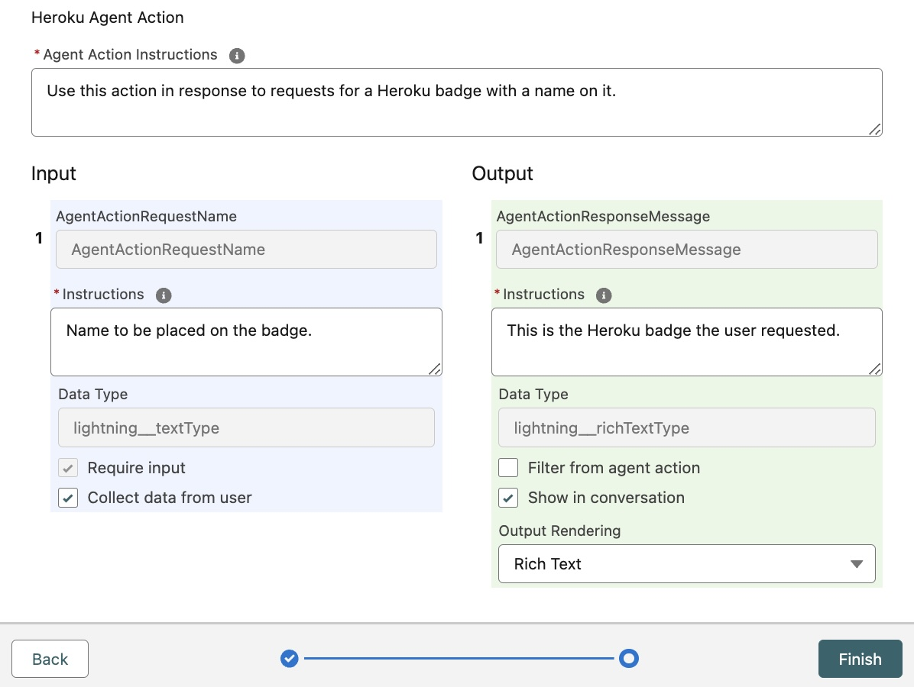

Creating Agentforce Custom Actions with Heroku
==============================================

This tutorial will guide you through how to configure an Agentforce Action deployed to Heroku within your Salesforce org. This allows Agentforce agents to access powerful custom coded actions written in Python and other languages that take advantage Heroku's fully managed and elastic compute service. At the end of it you will be able to generate your own badge as shown below!

> Ensure you have access to Agentforce by searching for `Agents` in the `Setup` menu. If not, you can create a temporary org by logging into Trailhead and creating a Playground per the instructions [at the top of this module](https://trailhead.salesforce.com/content/learn/projects/quick-start-explore-the-coral-cloud-sample-app/deploy-the-coral-cloud-sample-app) (you do not need to complete the module). Once you have access to the org, locate `Einstein Setup` under the `Setup` menu and enable Einsten, which will also enable Agentforce.

Want to learn more before diving in?
------------------------------------

The examples in this tutorial are intentially basic to allow you a clean starting point to develop your own actions. We have also provided fully built actions that we recommend you review first. When you are ready continue below to started building your own Agentforce Action with Heroku.

| Example | Demo Video |  | Related Content
| ------- | ---------- | ---------- | ---------------
| The **Archive Agent** action demonstrates using Heroku to access and perform complex compute over unstructed archived data using AI to interpret natural language requests from the user to perform a wider array of dynamic calculations on the data. | [Link](https://youtu.be/mNgrdf1GX-w)|  | [Blog](https://blog.heroku.com/building-supercharged-agents-heroku-agentforce) [Code](https://github.com/heroku-examples/agentforce-collage-agent)
| With the **Coral Cloud Collage Agent** we explore how the Coral Cloud Resort invites its guests to browse and book unique experiences throughout their stay using Agentforce. With Heroku, we extend the agents functionality to generate a personalized collage of each guest's adventures, showcasing how custom code deployed on Heroku can create dynamic digital media delivered directly within the Agentforce experience. | [Link](https://www.youtube.com/watch?v=yd97A9GLFUA&t=3s)|   | [Code](https://github.com/heroku-examples/agentforce-collage-agent)

Step 1 - Action API URL
-----------------------

This tutorial provides examples in Java and Python on how to code a basic Agentforce action. You can deploy these to your own Heroku account or proceed for now with the predeployed versions we have created for you.

| Language | Predeployed API URL | Predeployed API Test Page | Or Deploy your Own to Heroku
| -------- | --------------- | ------------------- | -----------
| Python | [Action API URL](https://agentforce-tutorial-python-7894e9215571.herokuapp.com/) | [Action API Test Page](https://agentforce-tutorial-python-7894e9215571.herokuapp.com/) | Go to this [GitHub Repository](https://github.com/heroku-examples/heroku-agentforce-tutorial-python)
| Java | [Action API URL](https://agentforce-tutorial-java-fd05948b2c0a.herokuapp.com) | [Action API Test Page](https://agentforce-tutorial-java-fd05948b2c0a.herokuapp.com/swagger-ui/index.html) | Go to this [GitHub Repository](https://github.com/heroku-examples/heroku-agentforce-tutorial-java)

With the above information you have two paths to take:
- **If you are using the predeployed versions**, right click the ***Action API URL*** link from above and copy the URL to your clipboard when requested below. Optionally, click the ***Action API Test URL*** to try the API out from your browser, this will be the Action API Agentforce will eventually callout to when invoking your action.
- **If you want to deploy your own action before proceeding**, follow the instructions in the respective repository above and return here with the deployed URL.

Step 2 - Creating a Named Credential
------------------------------------

1. Search for `Named Credentials` under `Setup` and select the `External Credentials` tab and click `New`, completing the dialog as shown.

    

2. Scroll down the next page to the `Principles` section and click `New`, completing the dialog as shown.

    

    > The default password for this tutorial is `agent`.

3. Search for `Named Credentials` under `Setup` and select the 'Named Credentials' tab and click `New`, completing the dialog as shown.

    

    > To obtain the URL value right click the desired `Predeployed API URL` above or use the one given to you after completing your own Heroku deployment. The one shown the screenshot above is the Java predeployment.

Step 3 - Registering the Action API
-----------------------------------

1. Search for `External Services` under `Setup` and click `Add an External Service` then select `From API Specification` and click `Next`, completing the dialog as shown then `Save & Next`.

    

    > To obtain the Schema shown, open the Swagger page for your deployed Action and click the link in the top left corner of the page this will be `/v3/api-docs` (Java) or `/swagger.json` (Python) and copy paste the entire contents. If you have not modified the code, or are using the predeployments above, you can click [here](https://agentforce-tutorial-java-fd05948b2c0a.herokuapp.com/v3/api-docs) (Java) or [here](https://agentforce-tutorial-python-7894e9215571.herokuapp.com/swagger.json) (Python).

2. Finally on the next page select the `Operation` shown below and click `Next`.

    

3.  Confirm you can see the input and output parameters as shown below and click `Finish`.

    

Step 4 - Assigning Permissions
------------------------------

1. Search for `Permission Sets` under `Setup` and click `New` and complete the page as shown, then click `Save`.

    

2. Locate the `External Credential Principle Access` section and edit it such that it appears as shown.

    

3. Finally, assign the permisison set to your current user using the `Manage Assignments` button.

Step 5 - Creating an Agentforce Action
--------------------------------------

1. Search for `Flows` under `Setup` and click `New Flow`. Click `Start from Scratch` then `Next` and select `Autolaunched Flow (No Trigger)` then click `Create` to open the `Flow Builder`. 

2. From the `Flow Builder`, open the `Toolbox` by clicking the sidebar icon near the top left of the screen. Click `New Resource` and create the following variable resources.

    | Resource Type | API Name | Data Type | Apex Class | Availability Outside the Flow |
    | ------------- | -------- | --------- | -----------| ----------------------------- |
    | Variable | AgentActionRequestName | Text | Not Applicable |Available for Input |
    | Variable | AgentActionResponseMessage | Text | Not Applicable | Available for Output |
    | Variable | AgentActionRequest | Apex Defined | ExternalService__HerokuAgentAction_AgentRequest | None |

    Your `Flow` should look like this so far.

    

3. Click the `+` icon in the middle of the canvas and select `Action`. In the `Search Actions` sidebar search for `Heroku`, select the `Post Process` action and complete fields as shown.

    

4. Click the `+` icon **before** the `Call Heroku` element on the canvas and select `Assignment` and complete as shown.

    

5. Click the `+` icon **after** the `Call Heroku` element on the canvas and select `Assignment` and complete as shown.

    

6. Finally your `Flow` should look like this.

    

7. Now click `Save` and enter `Heroku Agent Action` and click `Save`, followed by clicking `Activate`.

    Search for `Agent Actions` under the `Setup` menu and click `New Agent Action`, selecting `Flow` as the `Reference Action Type`

    In the `Reference Action` search field search for `Heroku` so that you see the following.

    

8. Complete defining the action as follows and click `Finish`.

    

    | Field | Text |
    | ----- | ---- |
    | `Agent Action Instructions` | Use this action to produce a unique Heroku badge with a custom name printed on it |
    | `AgentActionRequestName Instructions` | Name to be placed on the badge. Do not show the parameter name. |
    | `AgentActionResponseMessage Instructions` | Confirmation the badge has been created. |

Step 6 - Using Agent Builder
----------------------------

1. Search for `Agents` under `Setup` and be sure to toggle to enable `Einstein Copilot for Salesforce`.

2. Click the `Einstein Copilot` link at the bottom of the page to find the `Open in Agent Builder` button.

3. Click the `Deactivate` button in the top right of the screen if present.

4. Click `Topics` and the `General CRM` topic, if the `New Version` button is shown click it.

5. Click `This Topic's Actions` tab and select `Add from Asset Library` from the `New` button drop down.

6. Complete the dialog as shown and click `Finish`

    

7. Finally click the `Activate` button in the top right of the screen.

Step 7 - Testing your Action
----------------------------

1. Open the `Agent Builder` for `Einstein Copilot`

2. In the `Conversation Preview` enter `Generate my badge with the name Master Builder on it!`

    > You can of course change the name to your own and share your badge with your friends!

    

Summary
-------

Congratulations on deploying your first Heroku powered Agentforce Action! 

We are working to improve and simplify this process so please follow this reposistory to keep informed on updates.